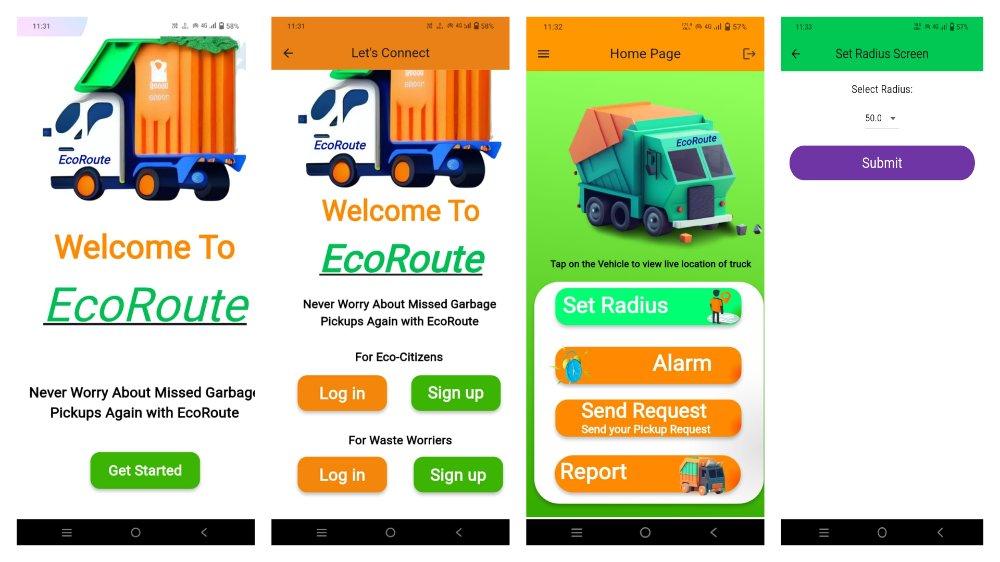
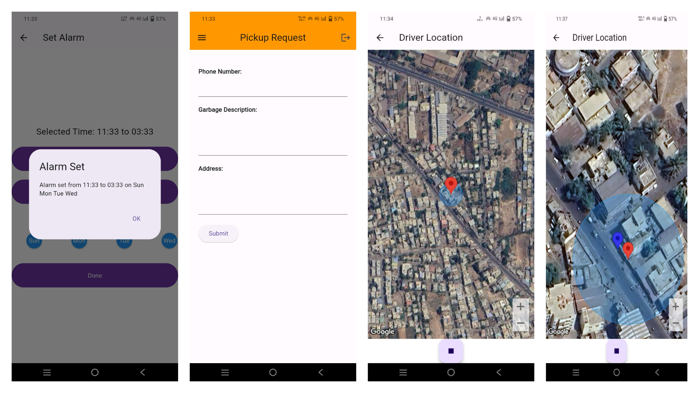

# EcoRoute: Revolutionizing the Waste Collection System

## Overview

- Developed and implemented an application using dart to track garbage collection (tipper) vehicles using real-time GPS. When a tipper  approaches the user's location, the user receives a notification of their arrival.
  - Separate Authentication for User as well as the vehicle driver with the help of Firebase Authentication.
  - Implemented the Push Notification Feature with the help of Flutter Push Notification Package.
  - Enabled user-customization features, such as the option to specify a radius for arrival alerts, and created an alarm feature.   
  - The alarm functionality works much like a standard alarm, allowing users to set alarms on a daily or scheduled basis.

